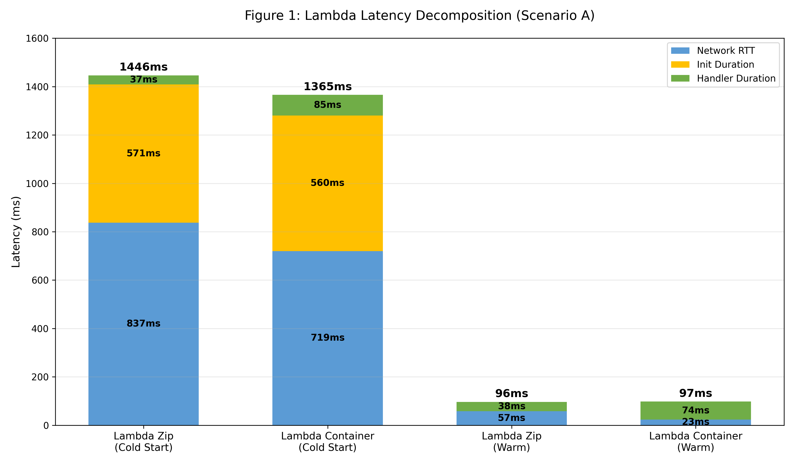
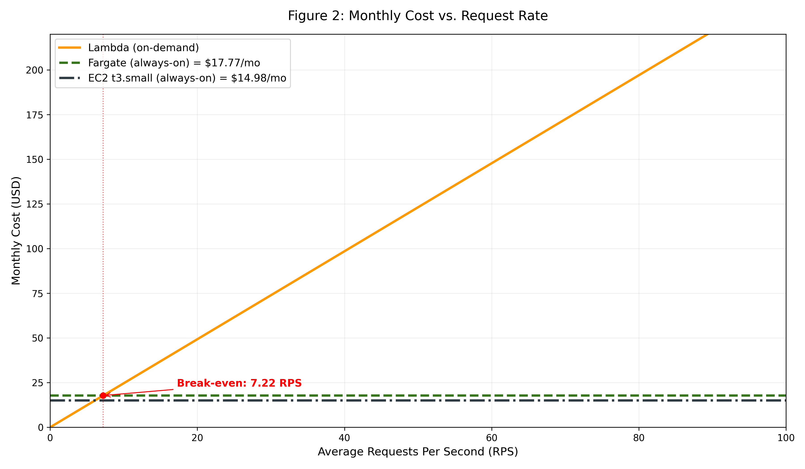

# Lab Report: AWS Cloud Execution Environments Analysis

All assignments were completed successfully and are detailed in the sections below.

## Assignment 1
Endpoints deployed and verified. Results match across all targets. Output is saved in `results/assignment-1-endpoints.txt`.

## Assignment 2
| | Lambda (ZIP) | Lambda (Container) |
| :--- | :--- | :--- |
| Cold Start - Client total | 1446.30 ms | 1365.70 ms |
| Cold Start - Init Duration | 571.53 ms | 560.87 ms |
| Cold Start - Handler | 37.64 ms | 85.12 ms |
| Cold Start - Network RTT | 837.13 ms | 719.71 ms |
| Warm Start - Client total | 96.50 ms | 97.70 ms |
| Warm Start - Handler avg | 38.75 ms | 74.38 ms |
| Warm Start - Network RTT | 57.75 ms | 23.32 ms |

Init Duration is similar for both ZIP and Container, but it is a bit higher for ZIP. It may indicate that the container deployment is better optimized by e.g. caching, and also unpacking a ZIP file adds some overhead.

## Assignment 3
| Environment | Concurrency | p50 [ms] | p95 [ms] | p99 [ms] | Server avg [ms] |
|---|---|---|---|---|---|
| Lambda (zip) | 5 | 98.6 | 120.7 | 145.0 | 97.4 |
| Lambda (zip) | 10 | 92.8 | 117.3 | 163.2 | 91.2 |
| Lambda (container) | 5 | 88.5 | 111.5 | 137.4 | 90.9 |
| Lambda (container) | 10 | 90.5 | 107.9 | 155.4 | 91.4 |
| Fargate | 10 | 796.1 | 1004.8 | 1101.8 | 797.1 |
| Fargate | 50 | 3896.5 | 4231.5 | 4419.3 | 3871.4 |
| EC2 | 10 | 162.7 | 239.5 | 267.2 | 161.8 |
| EC2 | 50 | 837.1 | 982.1 | 1039.6 | 821.5 |

There are no signals of tail latency instability.

Fargate/EC2 p50 is higher for concurrency 50, because the requests are handled on a single instance and have to wait in a queue. Lambda handle requests in separate environments, so the concurrency does not affect latency as much.

The latency difference between server-side and client-side is caused by network RTT overhead.

## Assignment 4
| Environment | p50 [ms] | p95 [ms] | p99 [ms] | Max Latency [ms] |
|---|---|---|---|---|
| Lambda (zip) | 94.3 | 264.3 | 740.6 | 791.9 |
| Lambda (container)| 70.6 | 253.2 | 1350.8 | 1385.5 |
| Fargate | 837.6 | 1094.1 | 1191.3 | 1259.1 |
| EC2 | 3991.6 | 4291.5 | 4411.5 | 4505.8 |

Init Duration was not measured due to AWS account deactivation.

Lambda's burst p99 is much higher than Fargate/EC2, because of cold starts. The first request is waiting for the environment to be initialized, which takes much more time than handling the request itself. Fargate and EC2 have much more stable latency, because they are always running and do not have cold starts.

It can be observed in `results/scenario-c-*.txt` files that Lambda latencies form a bimodal distribution, with a few requests having very high latency (cold starts) and the majority having low latency (warm starts).

Lambda does not meet the SLO of p99 < 500ms under burst traffic. It can be achieved by keeping the function warm (e.g. by sending periodic requests), which keeps a specified number of environments initialized and ready to handle requests, but will increase the usage cost.

## Assignment 5

#### Lambda

Lambda usage is charged on invocation count and duration. Idle cost is 0. Lambdas are paid per reqeusts and execution time, but the cold starts have to be taken into account.

#### Fargate
Calculated for 0.5 vCPU, 1 GB RAM. Idle cost is the same as active cost.

- Per hour cost: $\$0.04048 * 0.5 + \$0.004445 = \$0.024685$
- Monthly cost: $\$0.024685 * 24 * 30 = \$17.77$

#### EC2
Calculated for t3.small instance. Idle cost is the same as active cost.

- Per hour cost: $\$0.0208$
- Monthly cost: $\$0.0208 * 24 * 30 = \$14.98$

## Assignment 6

### Monthly cost

- **Peak:** 100 RPS (30 min/day)
- **Normal:** 5 RPS (5.5 h/day)
- **Idle:** 0 RPS (18 h/day)

That gives $100 * 30 * 60 + 5 * 5.5 * 60 * 60 = 279000$ requests per day and $279000 * 30 = 8370000$ requests per month.

- Lambda:
    - GB-seconds: $8370000 * 0.09 * 0.5 = 376650$
    - Monthly cost: $8370000 * \$0.0000002 + 376650 * \$0.0000166667 = \$7.95$

- Fargate: $\$17.77$
- EC2: $\$14.98$

### Break-even RPS

$\text{Lambda cost} = \text{requests} \times \$0.0000002 + (\text{requests} \times 0.09 \times 0.5) \times \$0.0000166667 = \text{requests} \times (\$0.0000002 + \$0.0000166667 \times 0.09 \times 0.5) = \text{requests} \times 9.500015 \times 10^{-7} = \$0.0000009500015 \times \text{requests} = \text{Fargate cost} = \$17.77 \Rightarrow \text{requests per month} = \frac{\$17.77}{\$0.0000009500015} \approx 18,705,000 \Rightarrow \text{Break-even RPS} = \frac{18,705,000}{30 * 24 * 60 * 60} \approx 7.22$

The initial configuration had $\frac{8370000}{30 * 24 * 60 * 60} \approx 3.23$ RPS, which is below the break-even point, so Lambda is more cost-effective in this scenario. If the traffic increases to around 7.22 RPS, the costs of Lambda and Fargate would be approximately equal.

I recommend using Lambda despite not meeting the SLO under burst traffic. However, the other environments do not meet the SLO either, and Lambda is much more cost-effective for the expected traffic pattern. To mitigate cold start issues, a warm-up strategy can be implemented to keep a certain number of environments initialized, or Provisioned Concurrency can be used, which keeps a specified number of environments always ready to handle requests, but will increase the cost. The recommendation would change if the average load exeeds 7.22 RPS, in which case Fargate would become more cost-effective.
